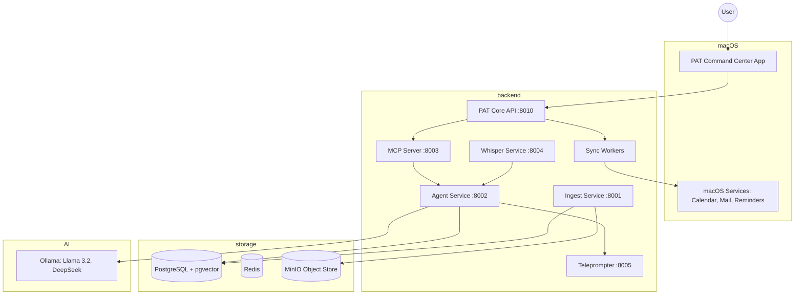

# PAT System Architecture

## Overview

PAT (Personal Assistant Twin) is a local-first, AI-powered personal assistant system. It utilizes a microservices architecture to provide interview assistance, productivity management, and enterprise intelligence.

## Component Diagram

## Microservices Description

### 1. PAT Core API (Port 8010)
The central orchestration layer for personal assistant features. It handles:
- Calendar CRUD and AI optimization
- Email classification and processing
- Task management and prioritization
- Integration with macOS via AppleScript

### 2. Agent Service (Port 8002)
The "brain" of the system. It handles:
- RAG (Retrieval-Augmented Generation) from user documents
- Interview question analysis
- Communication with local LLMs via Ollama

### 3. MCP Server (Port 8003)
Implements the Multi-Chain Planning protocol to handle complex, multi-step requests using ReAct reasoning.

### 4. Ingest Service (Port 8001)
Handles document uploading, text extraction, chunking, and embedding generation for the RAG system.

### 5. Whisper Service (Port 8004)
Local speech-to-text service for real-time interview transcription.

### 6. Teleprompter (Port 8005)
A WebSocket-based real-time display service that shows AI-generated answers during interviews.

## Data Flow

1. **Interview Mode**: Microphone -> Whisper Service -> Agent Service (RAG) -> Teleprompter (Display).
2. **Personal Assistant Mode**: App/User -> PAT Core API -> Sync Workers -> macOS Calendar/Mail.
3. **Document Ingestion**: PDF/Doc -> Ingest Service -> pgvector (PostgreSQL) + MinIO.

## Security & Privacy
- **100% Local**: All processing, including LLM inference, happens on the local machine.
- **No Cloud Dependency**: Optional cloud models can be used, but the default is local.
- **Storage**: Documents are stored in a local MinIO instance.

## Technology Stack
- **Languages**: Python (Backend), Swift (macOS App), SQL.
- **Frameworks**: FastAPI, SwiftUI, SQLAlchemy.
- **AI/ML**: Ollama, Llama 3.2 3B, DeepSeek, Whisper.
- **Infrastructure**: Docker, PostgreSQL, Redis, MinIO.
